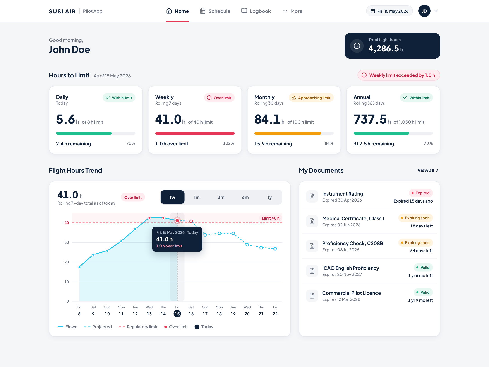
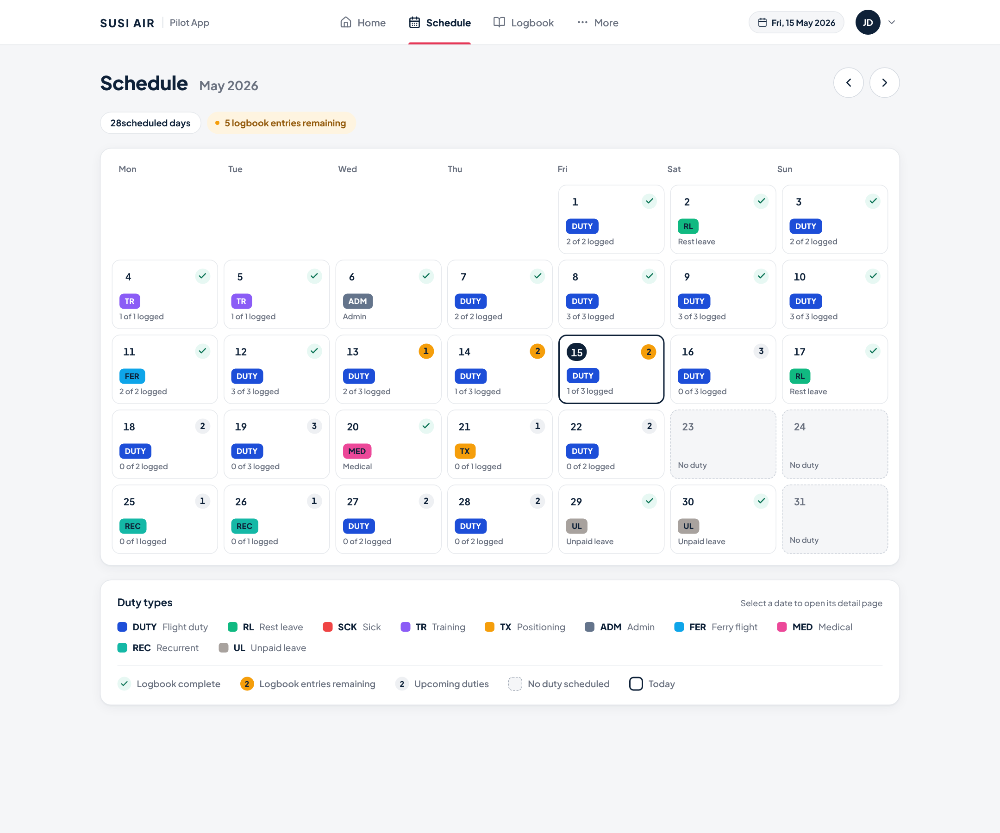
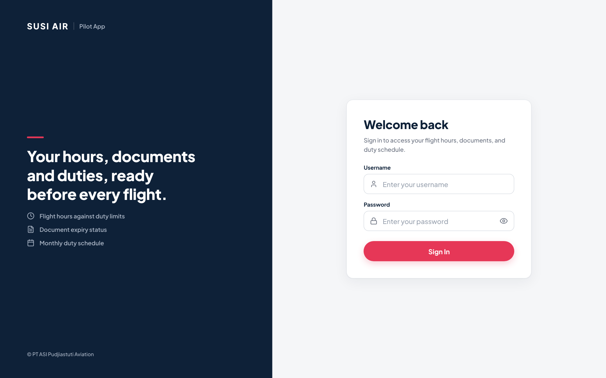

# Susi Air Pilot App

A small piece of the Susi Air Pilot App, built for the Fullstack Developer technical test. It is a mobile web app where a pilot signs in and sees their flight hours against the duty limits, their document expiries and their monthly schedule.

|              |                                       |
| ------------ | ------------------------------------- |
| Frontend     | https://susi-air-ali.vercel.app       |
| API          | https://susi-air-pilot.fly.dev/api/v1 |
| Test account | `johndoe` / `susiairtest`             |

## Repository layout

| Folder          | What it is                                                          | Setup and environment variables  |
| --------------- | ------------------------------------------------------------------- | -------------------------------- |
| [`nuxt/`](nuxt) | Frontend: Nuxt 3, Pinia, Tailwind CSS 4 and SCSS, Chart.js, Reka UI | [nuxt/README.md](nuxt/README.md) |
| [`nest/`](nest) | REST API: NestJS on Fastify, zod, in-memory data seeded from JSON   | [nest/README.md](nest/README.md) |

## Quick start

Run the API first, then the frontend, each in its own terminal. Use Node.js 24, the version the API's `Dockerfile` uses.

```bash
# Terminal 1: API on http://localhost:3001
cd nest
npm install
cp .env.example .env
npm run start:dev

# Terminal 2: frontend on http://localhost:3000
cd nuxt
npm install
cp .env.example .env
npm run dev
```

Both `.env.example` files set `TODAY=2026-05-15`, the date the brief asks the app to treat as today. Keep the two values the same. The full list of variables is in each app's README.

## What is built

**Backend**

- `POST /auth/login`, plus `/auth/refresh` and `/auth/logout`
- `GET /pilot/me`
- `GET /flight-hours?from=&to=`
- `GET /flight-hours/limits` for the four Hours to Limit cards
- `GET /flight-hours/summary?range=` for the trend chart
- `GET /documents`
- `GET /schedules?year=&month=`
- Module, controller, service, repository and DTO separation in every feature
- Input validation with zod on every endpoint that takes parameters
- An auth guard on every endpoint except the ones under `/auth`
- Both rolling sums (`/limits` and `/summary`) are calculated on the server

**Frontend**

- Sign In, Home and Schedule screens, all reading from the API
- Edge cases: 404, maintenance and unexpected error pages, loading and error states per section, and placeholder pages. Screenshots are in [nuxt/README.md](nuxt/README.md#edge-cases-and-states).

## Main choices

### Authentication

The API uses NestJS's built-in `@nestjs/authentication`. I considered three ways to hold the session in the browser:

1. Access token in an `httpOnly` cookie set by the API.
2. Access token in memory, refresh token in an `httpOnly` cookie.
3. Access token in a readable cookie or `localStorage`, so the frontend can read and reuse it.

I went with option 2. The access token never touches storage that a script could read, and the refresh token cannot be read by scripts at all.

The problem with this option is that a cookie cannot be shared across domains, and the frontend is on Vercel while the API is on Fly.io. The solution is to send every request through the frontend's own `/api/v1` path, which Nuxt proxies to the API. The browser only ever talks to one origin, so the cookie works.

Two more protections go with the cookie: it is `SameSite=Strict` and scoped to `/api/v1/auth`, and the API's `OriginGuard` refuses write requests from any origin outside `CORS_ORIGIN`.

### API structure

- **URI versioning** (`/api/v1`), so a later version can live beside this one.
- **A config module** that validates environment variables with zod at startup.
- **A mock database module** that loads the JSON files into memory. Only repositories read it, so replacing it with a real database would not touch services or controllers.
- **zod for validation and serialization.** Each route declares a schema for its input and its output. Validation errors come back keyed by field, so the sign-in form can show each message under its input.

### A configurable "today"

Neither app uses the real date. Both read `TODAY` from the environment, so the app behaves the same whenever it is reviewed.

### Deploying each milestone

Every milestone was deployed as soon as it worked, the frontend to Vercel and the API to Fly.io, instead of deploying once at the end.

## Hours to Limit: how the rolling sum works

All of the math is in `nest/src/modules/flight-hours/flight-hours.service.ts`; the frontend only renders what the API returns.

The rolling sum for a day is the total of the hours from that day back through the window: 1 day for daily, 7 for weekly, 30 for monthly and 365 for annual. The limits and chart bounds are read from `mock-flight-hours.json`. Each value comes with a status: `within`, `approaching` (80% of the limit or more), `at_limit` or `over`.

How the cases in the brief are handled:

- **Days with zero flight hours** count as 0. No date is skipped.
- **Dates near the start of the dataset.** When the window reaches back before the first entry (27 Dec 2024), the sum uses the days that exist and counts the earlier ones as 0.
- **Future dates.** The dataset has entries up to 31 May 2026, after the simulated today. For a future date the sum includes those entries, and the point is returned with `projected: true`. It answers "where will the rolling total be if these hours are flown". In the mock data the 7-day total crosses the 40-hour limit from 18 to 21 May.
- **Values above the limit.** The API returns them as they are with the status `over`. The chart extends its Y axis instead of clipping.

## How the trend chart is built

`GET /flight-hours/summary?range=1w` returns the window, the limit, the suggested Y max, today's value and 15 points: 7 days before today, today and 7 days after, so today is always centred.

The frontend draws them with Chart.js:

- The line is solid and filled up to today, and dashed after it for projected days.
- The red dashed limit line comes from the annotation plugin, at the limit for the selected range.
- The Y max starts from the API's value and grows in steps when a point is higher.
- A small custom plugin draws the halo on today's point and the highlight on the selected day.
- The date row under the chart is made of buttons, so each day's value can be read by tapping or with the keyboard.

Changing the range toggle (`1w`, `1m`, `3m`, `6m`, `1y`) fetches that range from the API.

## How the calendar is built

The calendar uses Reka UI's headless calendar parts with `@internationalized/date`. The month on screen is the single source of truth: the previous and next buttons change it, and every change calls `GET /schedules?year=YYYY&month=MM`.

Each day cell shows:

- the date, with today outlined;
- a pill with the entry's `base_name`, filled with `base_color` from the API, with the text colour picked for contrast;
- a tick when `count_logbooks` equals `count_schedules`, otherwise the number still to log.

The legend under the calendar is rendered from the API's legend, and tapping a date opens the "Detail page coming soon" placeholder.

## Implementation journey

### Planning

- Read the brief and requirements.
- Created UI mockups from the brief for mobile and desktop.
- Decided to deploy each milestone to a server.

### Execution

1. **Frontend first.** Built every required screen (Sign In, Home, Schedule) and the edge-case screens (not found, maintenance, coming soon) for mobile, then deployed to Vercel.
2. **Bootstrapped the NestJS backend:** API versioning, the config module, the mock database module, validation and serialization with zod, and deployment to Fly.io.
3. **Implemented and integrated authentication** (see [Authentication](#authentication)).
4. **Integrated the Home page** section by section: Hours to Limit, My Documents, then Flight Hours Trend.
5. **Integrated the Schedule page.**

### Improvements

- Added a loading indicator to the Schedule page.
- Refactored for reuse and added error states.
- Added `GET /flight-hours?from=&to=`.

## Known limitations

- Refresh tokens are kept in the API's memory: a restart signs everyone out, and the API must run on a single machine.
- The mock data has no pilot id, so every account sees the same flight hours, documents and schedule.
- Mock passwords are stored and compared as plain text.
- When `TODAY` is not set, both apps fall back to the real date.

## What I would do next

### Frontend

- Implement the desktop view.
- Make the app a PWA.

**Desktop view preview.** Mockups of the planned layout at 1440 px. The data in them is illustrative; in the app every value comes from the API.

| Home | Schedule |
| --- | --- |
|  |  |

| Sign In |
| --- |
|  |

### Backend

- Implement proper logging.
- Improve auth session storage.

### Others

- Set up GitHub Actions to run the tests before each deployment.
- Set up an AI review agent on GitHub pull requests.
