# Susi Air Pilot App: Frontend

The Nuxt 3 frontend for the Susi Air Pilot App: a mobile-first web app where a pilot signs in and sees their flight hours against the duty limits, document expiries and monthly schedule. All data comes from the [NestJS API](../nest/README.md); nothing is mocked in the frontend.

For the project overview, the decisions behind it and what comes next, see the [root README](../README.md).

## Requirements

- Node.js 24 (the version the API's `Dockerfile` uses)
- npm
- The API running locally (see [`nest/README.md`](../nest/README.md)) or a deployed API URL

## Setup

```bash
cd nuxt
npm install
cp .env.example .env
npm run dev
```

The app is now at `http://localhost:3000`. Sign in with `johndoe` / `susiairtest`.

## Environment variables

| Variable | Example | What it does |
| --- | --- | --- |
| `API_BASE_URL` | `http://localhost:3001` | Base URL of the API, without a path. Nuxt proxies `/api/v1/**` to it, so the browser only ever talks to the frontend's own origin. When unset, the proxy points at the deployed API (`https://susi-air-pilot.fly.dev`). |
| `TODAY` | `2026-05-15` | The date the app treats as today, `YYYY-MM-DD`. Set it to `2026-05-15` so the mock data lines up. When empty, the real date (UTC) is used. Keep it the same as `TODAY` in `nest/.env`. |

Both are read in `nuxt.config.ts` when the app is built, so on a host such as Vercel they must be set before the build runs.

## Scripts

| Command | What it does |
| --- | --- |
| `npm run dev` | Development server on `http://localhost:3000` |
| `npm run build` | Production build |
| `npm run preview` | Serve the production build locally |
| `npm run typecheck` | Type-check with `vue-tsc` |

## Screens

| Route | Screen |
| --- | --- |
| `/login` | Sign in |
| `/` | Home: greeting, total flight hours, Hours to Limit cards, Flight Hours Trend chart, My Documents |
| `/schedules` | Monthly calendar with duty types, logbook status and legend |
| `/schedules/:date` | Placeholder for the duty detail page |
| `/logbooks`, `/more` | Placeholders |

Every route except `/login` needs a signed-in pilot; the `auth` middleware redirects otherwise.

## Project structure

```
├── pages/               # Routes (see Screens)
├── layouts/             # default (bare) and dashboard (top bar + bottom navigation)
├── components/
│   ├── home/            # Hours to Limit, Flight Hours Trend, My Documents
│   ├── layout/          # Top bar and bottom navigation
│   └── ui/              # Button, card, badge, input, progress, avatar, error state
├── composables/         # One per API resource, plus useAuth and useToday
├── stores/auth.ts       # Pinia store: session, sign in, sign out, token refresh
├── plugins/
│   ├── api.ts           # $api: fetch with the access token, retries once after a 401
│   └── auth.client.ts   # Restores the session after a page reload
├── middleware/auth.ts   # Route guard
├── error.vue            # 404, maintenance and unexpected error page
└── assets/              # Tailwind theme (brand palette) and the Plus Jakarta Sans font
```

## How sign-in works

- The **access token** is kept only in memory (the Pinia store), never in storage or a cookie that scripts can read.
- The **refresh token** is an `httpOnly` cookie the API sets on `/api/v1/auth`. Because the frontend and the API are on different domains, requests go through the Nuxt proxy so the cookie belongs to the frontend's origin.
- A small `susi_session` cookie holds only who is signed in, so server rendering and the route guard know without the token.
- After a reload the access token is gone, so the app asks `/auth/refresh` for a new one. It also refreshes 30 seconds before the token expires, one request at a time across tabs.

Signed-in data is fetched in the browser only (`server: false`), since the token does not exist on the server.

## Edge cases and states

Beyond the three main screens, the app handles the states below. The screenshots were captured from a local production build at 390 × 844 with `TODAY=2026-05-15`.

### Error pages

`error.vue` renders a full-page error for the status code it receives. The buttons change with the session: a signed-in pilot gets links back into the app, a signed-out visitor gets a link to sign in.

| Page not found (signed in) | Page not found (signed out) | Unexpected error | Maintenance |
| --- | --- | --- | --- |
| 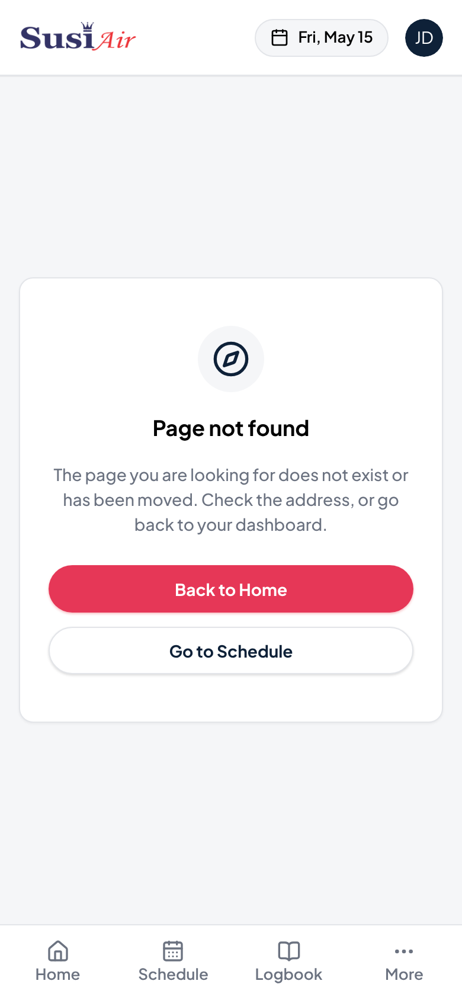 | 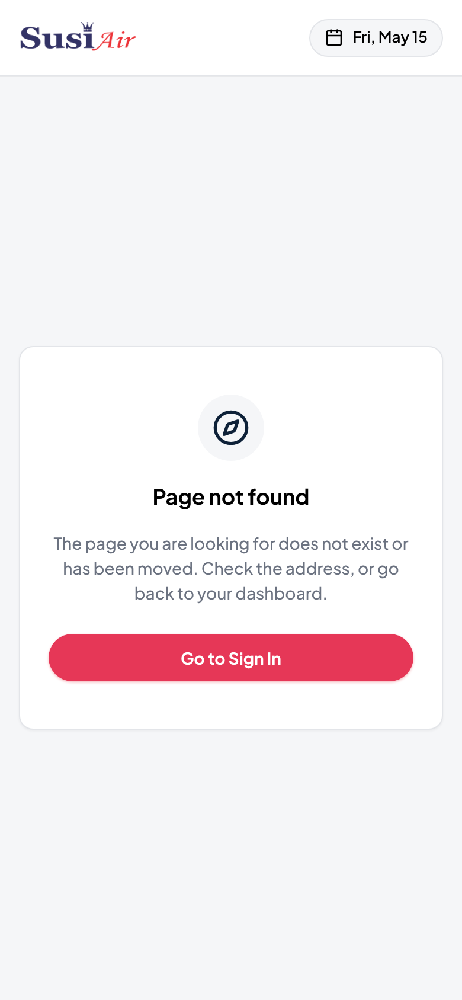 | 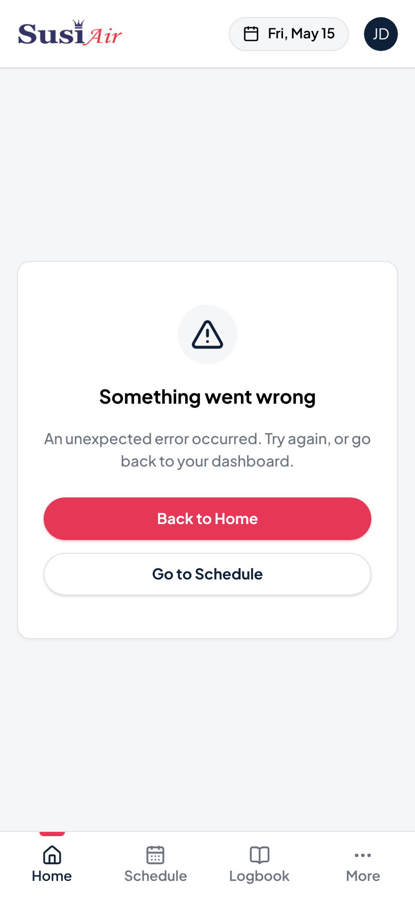 | 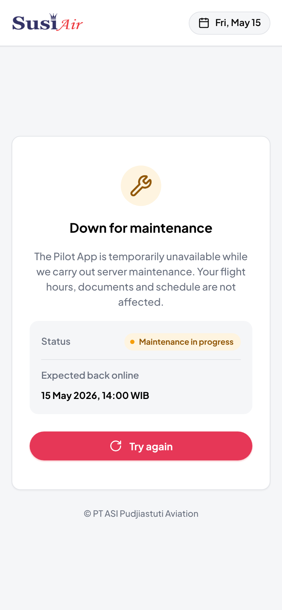 |
| Any unknown URL, for example `/nope` | The same URL without a session | Any error that is not 404 or 503 | A `503` error. The time shown comes from `error.data.expectedAt`. |

The maintenance page hides the avatar and navigation, and its **Try again** button reloads the current route. Nothing in the app raises a `503` yet; the screenshot was made by raising the error by hand.

### Loading states

Each section loads on its own and shows a skeleton in its final shape, so the page does not jump when the data arrives.

| Home | Schedule |
| --- | --- |
| 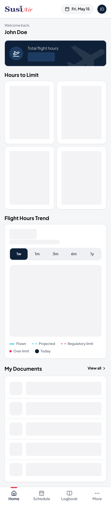 | 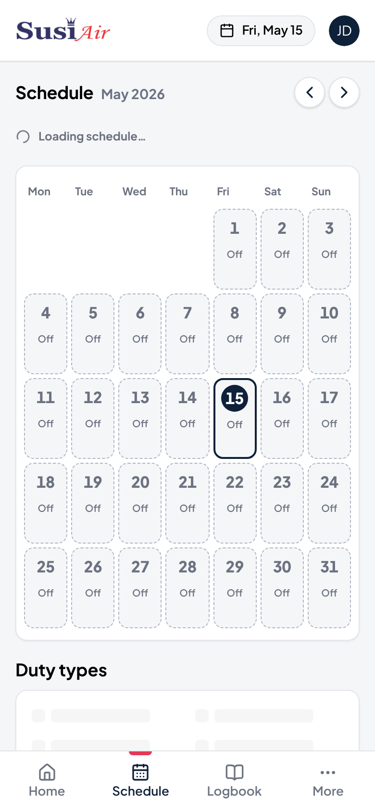 |
| Skeletons for total hours, the four limit cards, the chart and the documents list | A "Loading schedule…" indicator while a month is fetched; the calendar grid stays in place and is dimmed |

### Request errors

When a request fails, only that section is replaced by a message with a **Try again** button; the rest of the page keeps working.

| Home | Sign in: wrong credentials | Sign in: API unreachable | Sign in: empty fields |
| --- | --- | --- | --- |
| 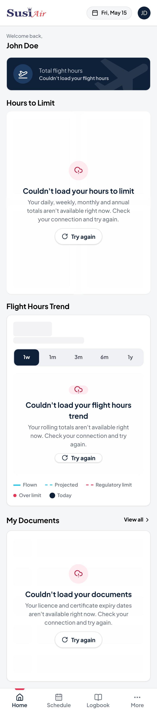 | 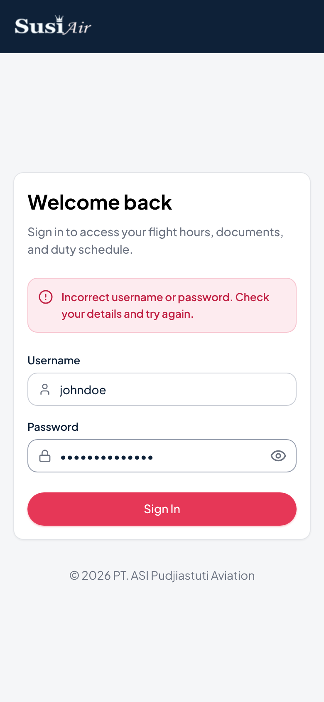 | 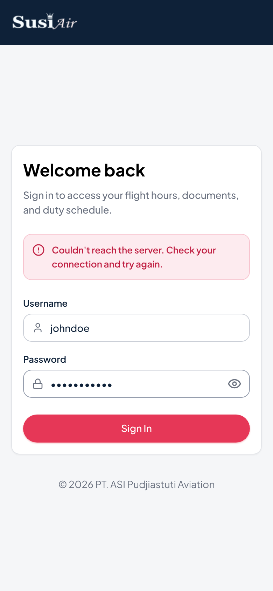 | 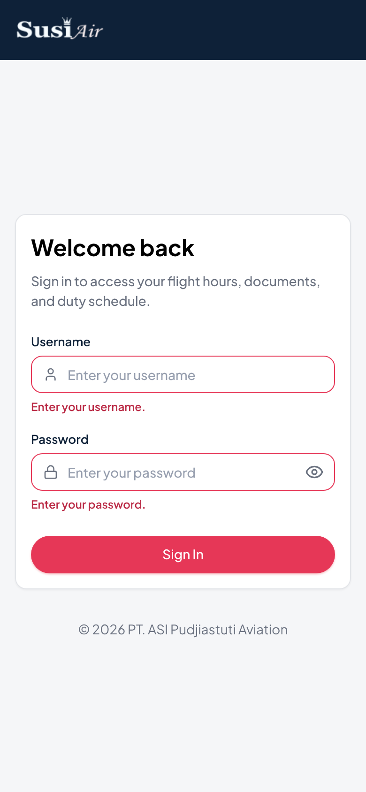 |
| Each section has its own message and retry | The API's `401` | A network error or any other status | Checked in the browser first; the API's `400` field errors are shown the same way |

A `401` on any signed-in request triggers one token refresh and a retry. If the refresh fails, the session is cleared and the pilot is sent to `/login`.

### Over-limit values on the chart

Some days push the rolling sum above the limit. The chart extends its Y axis in steps instead of clipping, marks those points in red and shades the area above the limit line.

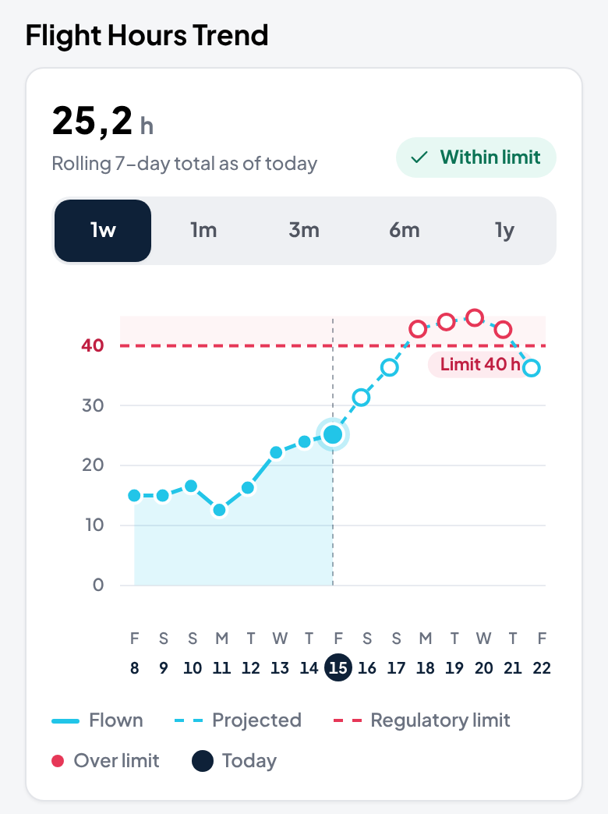

### Placeholder pages

| Schedule detail | Logbook and More |
| --- | --- |
| 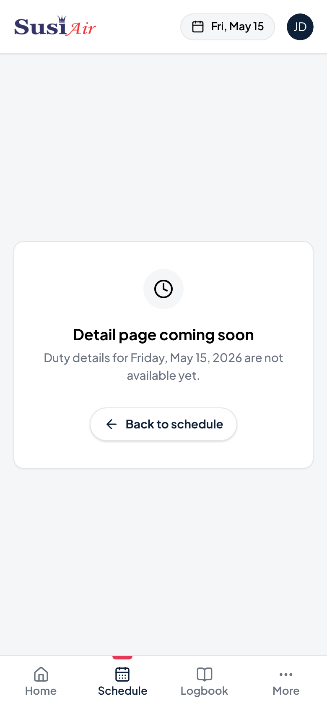 | 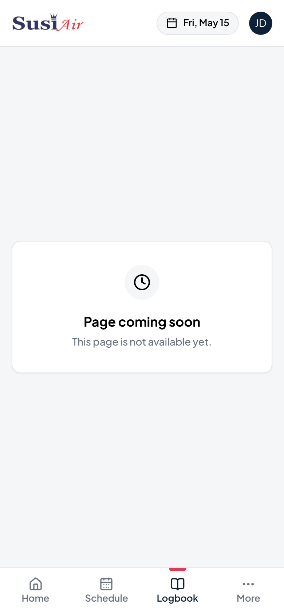 |
| Tapping a date opens `/schedules/:date`. A value that is not a date returns the 404 page. | `/logbooks` and `/more` |

### Not covered yet

- The Schedule page has no error state: if the request fails, the calendar shows an empty month.
- The maintenance page is not connected to a trigger, and shows a `[TIME AND DATE]` placeholder when no time is given.

## Deployment

The frontend is deployed to Vercel. Set `API_BASE_URL` to the deployed API and `TODAY` to `2026-05-15` in the project's environment variables, then deploy. The API's `CORS_ORIGIN` must include the frontend's URL.
